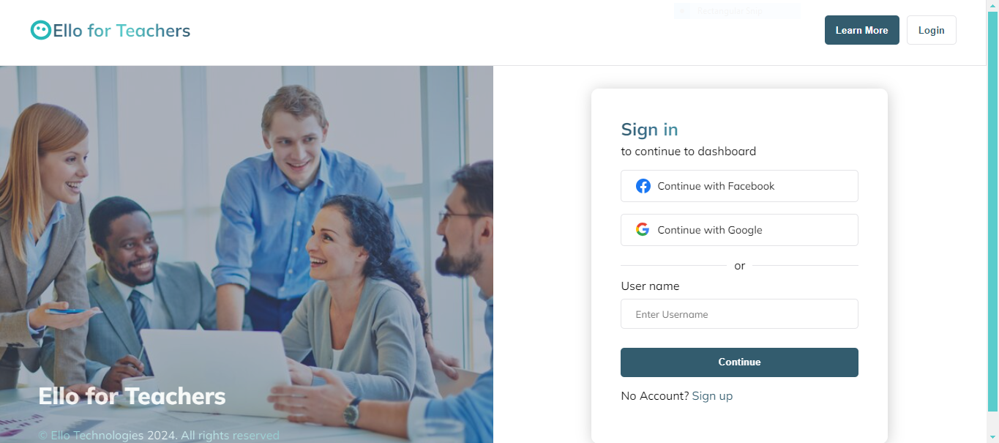

# Mark Onyango - Ello Engineering Solution 2

Welcome to my submission for the Ello Engineering Challenge! Below you'll find information about the project structure, how to run the application, and key features implemented.

## Project Overview

This project implements a teacher-facing UI for the Ello web viewer product, specifically focusing on the book assignment view. Teachers can search for books, add them to a reading list, and remove them as needed.

### Features Implemented

1. **Search Bar:**
   - Allows users (teachers) to search for books by title.
2. **Search Results:**
   - Displays search results with book title, author, and an "Add to Reading List" button.
3. **Reading List:**
   - Displays all books that have been added by the teacher.
   - Each book in the reading list has a "Remove" button to remove it from the list.
4. **Books Player:**
   - Allows users (teachers) to preview a book before adding to reading list

### Technology Stack

- **Frontend Framework:** React.js
- **UI Library:** Material-UI
- **Fonts:** Mulish (from Google Fonts)
- **Styling:** Custom styling adhering to Ello's color palette guidelines.

### App Screenshots

**1st Design**


**2nd Design**


**3rd Design**


**4rth Design**


**5th Design**


**6th Design**


**Mobile Design**


**Mobile Design**


## Getting Started

To run this application locally, follow these steps:

1. Clone this repository.
2. Navigate to the `src/backend` directory.
3. Install dependencies:
   ```bash
   npm install
   ```
4. Start the Server
   ```bash
   npm start
   ```
5. Navigate to `src/frontend` directory
6. Install dependencies:
   ```bash
   npm install
   ```
7. Start the App
   ```bash
   npm run dev
   ```

## Authentication

The app does not implement backend authentication. When prompted, use username as `admin` and password as `password` to login

## Connecting backend url

If git ignores the `.env` file

1. Navigate to `src/frontend` directory

2. Create a new file called

```bash
 .env.local
```

3. Inside the file, paste this code

```bash
 VITE_BACKEND_URL=http://localhost:4000/
```

## License

This project is licensed under the MIT License. See the [LICENSE](./LICENSE) file for details.

##

Thank you for considering my submission. I look forward to discussing it further with you!
